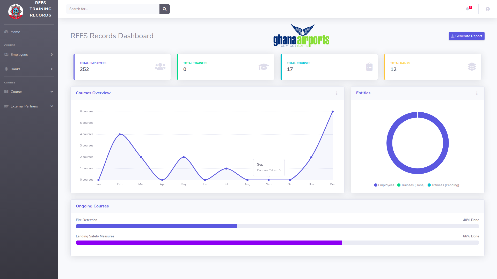
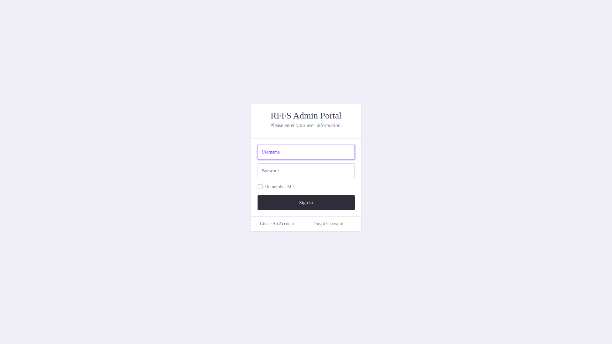
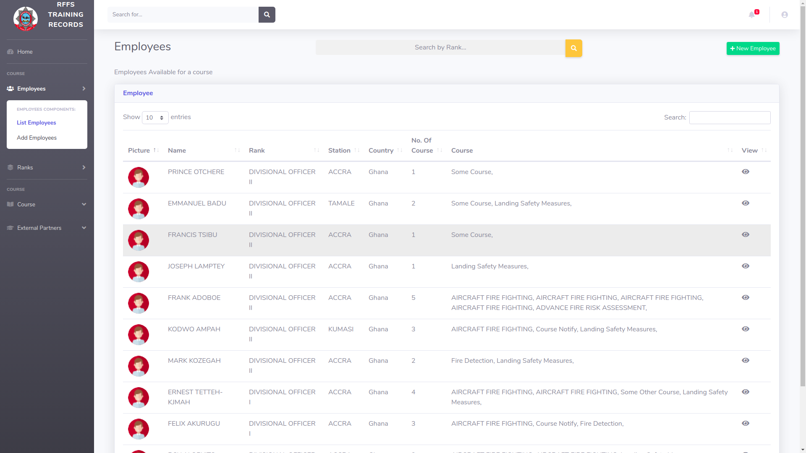
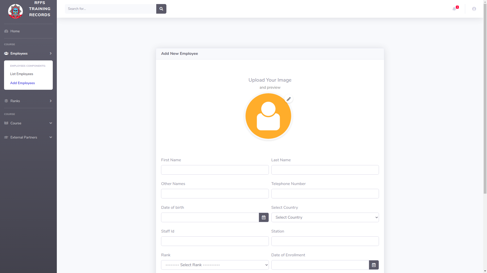

# Ghana Airport Service

### Introduction
This project is a simple project built for Ghana Airport Services
to keep records of employees, trainees and courses with partners in
the system.
This project was built with Python and Django as the backend
and Bootstrap as the frontend framework and some other utilities
including Chart.js for statistical analytics

#### Architecture of the project
1. Authentication
2. Employees
3. Trainees
4. Courses


##### Authentication
This section takes care of basic authentication including login/logout
and registration.

##### Employees
This section implements the basic CRUD (Create, Read, Update and
Delete) functionality to manage employees in the system.

##### Trainees 
This section also implements the basic CRUD (Create, Read, Update 
and Delete) functionality to manage trainees in the system.

##### Courses
This section also implements the basic CRUD (Create, Read, Update
and Delete) functionality to manage courses in the system.


### Installation Guide
###### Requirement
There is really no heavy requirement but just 
- Python 3.7 and above
- And a virtual environment (venv, pipenv, etc)

### Guide
1. After activating your virtualenv, run the following code;
```shell script
pip install -r requirements.txt
python manage.py migrate
python manage.py loaddata users.json
python manage.py runserver
```
2. Open the browser and navigate to localhost:8000

###### NOTE:
- Be sure to clone this repo and move into the directory
 as following before running the above code:
```shell script
git clone https://github.com/kali-physi-hacker/Course.git
cd Course
```


